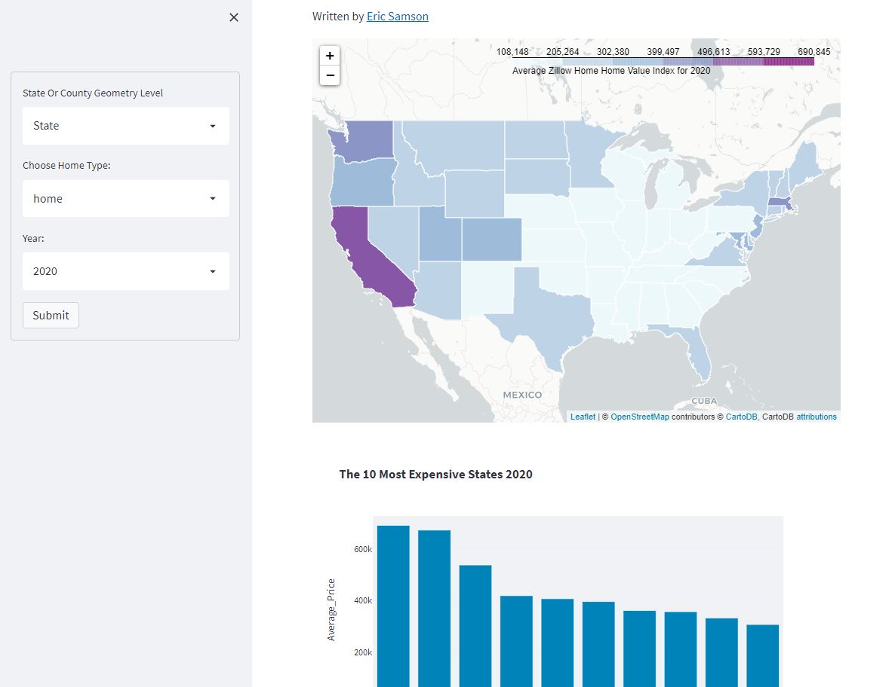
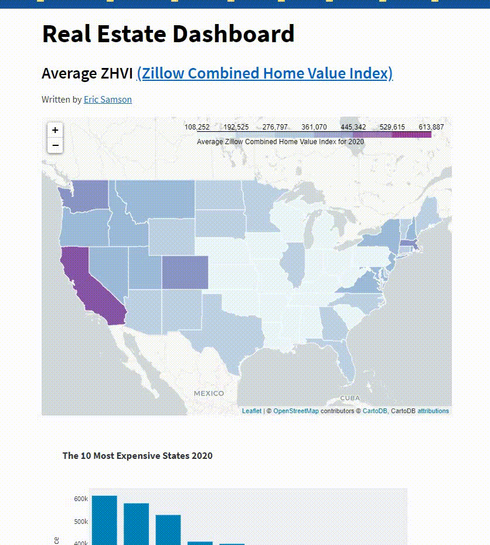

# ZHVI-Streamlit-Dashboard
Zillow Combined Home Value Index Streamlit Dashboard written in python


This application allows you to query Zillow's ZHVI dataset by:<br>
- Geometry type - State or County<br>
- Hometype - Home, Condo, Combined<br>
- Year<br>

<b> All within a streamlit dashboard. </b> <br>


<h3>Launch Locally</h3> 

```bash
streamlit run zillow_app.py
```
